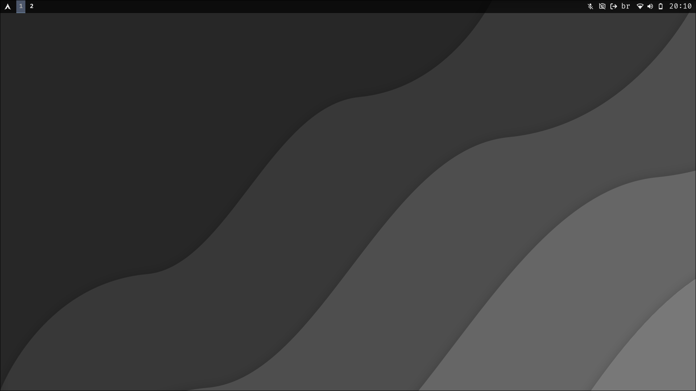
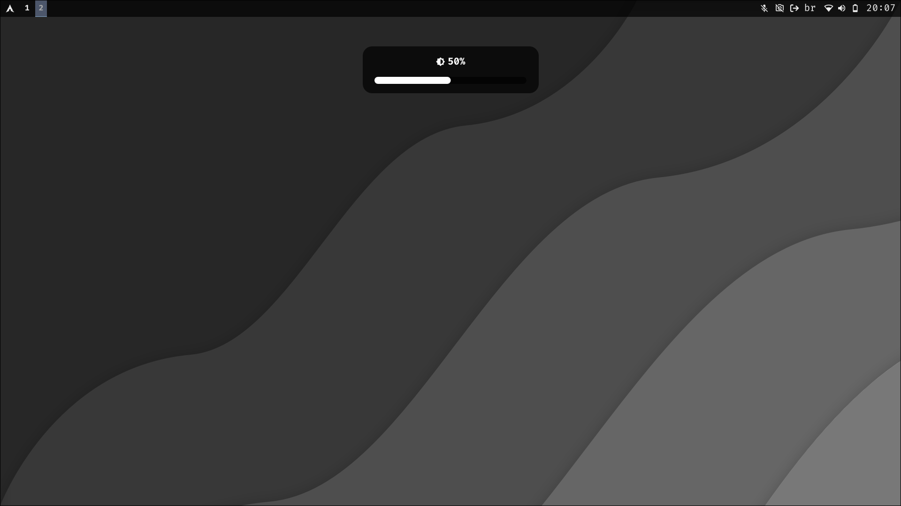

Hyprland Configs :)

Instalar apenas as configurações do **waybar**, **wofi** e **hyprland**:
```bash
sudo pacman -S brightnessctl wofi waybar hyprpaper hyprlock hypridle udiskie ttf-firacode-nerd dunst
 
git clone https://github.com/enthonyaraujo/hyprdots.git

cd hyprdots/

cp -r /$HOME/hyprdots/waybar/ /$HOME/hyprdots/wofi/ /$HOME/hyprdots/hypr/ /$HOME/hyprdots/kitty/ /$HOME/.config/
```

<p align="center">

</p>

<p align="center">

</p>

<p align="center">

</p>

<p align="center">

</p>


