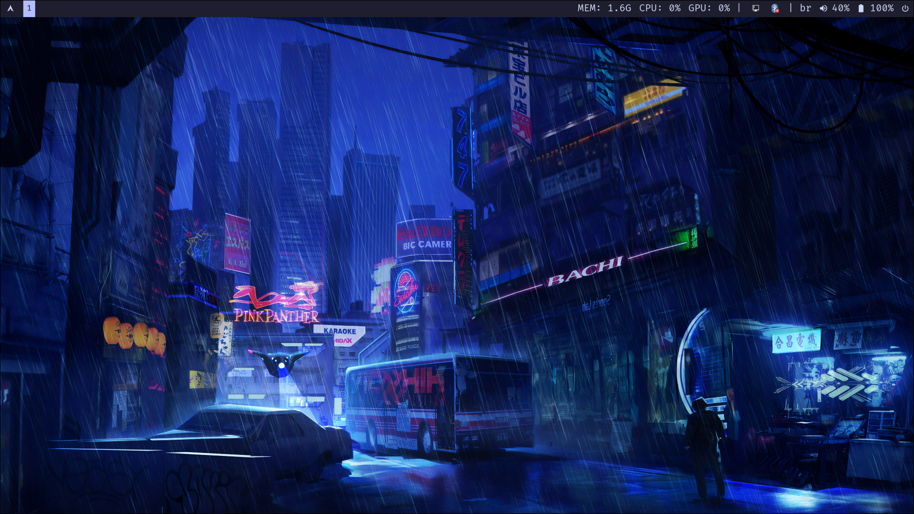
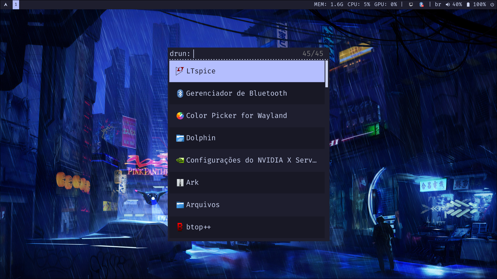
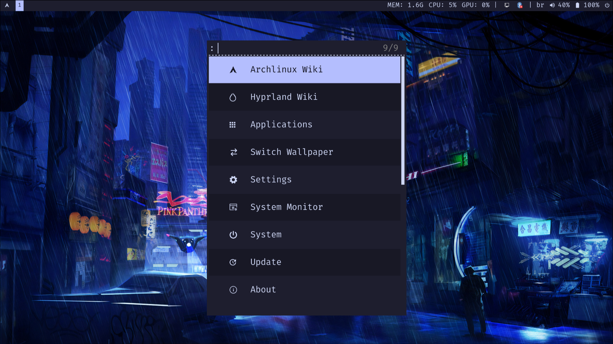
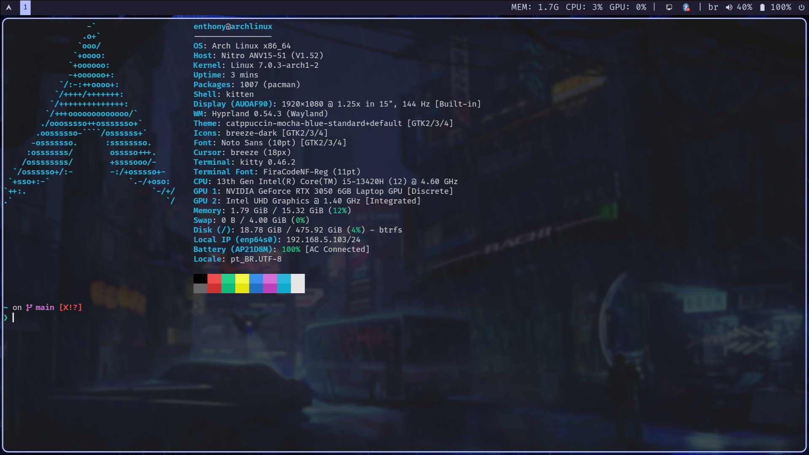
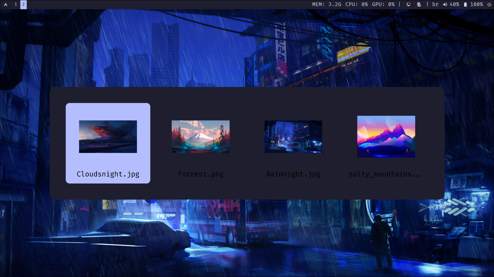

Minhas dotfiles com Hyprland + ArchLinux
--- 
* Waybar
* Rofi
* Nvim
* Hyprpaper
* Hyprlock
* Hypridle
* Kitty

Ferramentas que utilizo: 
* Obsidian
* Latex & Texstudio
* Xournal++

Tema usado: [Catppuccin](https://github.com/catppuccin)

