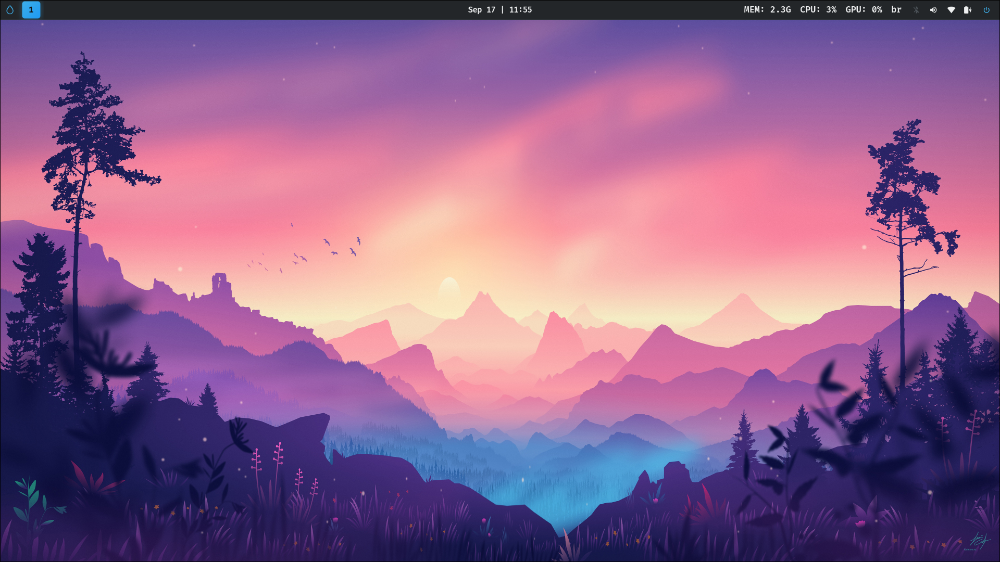
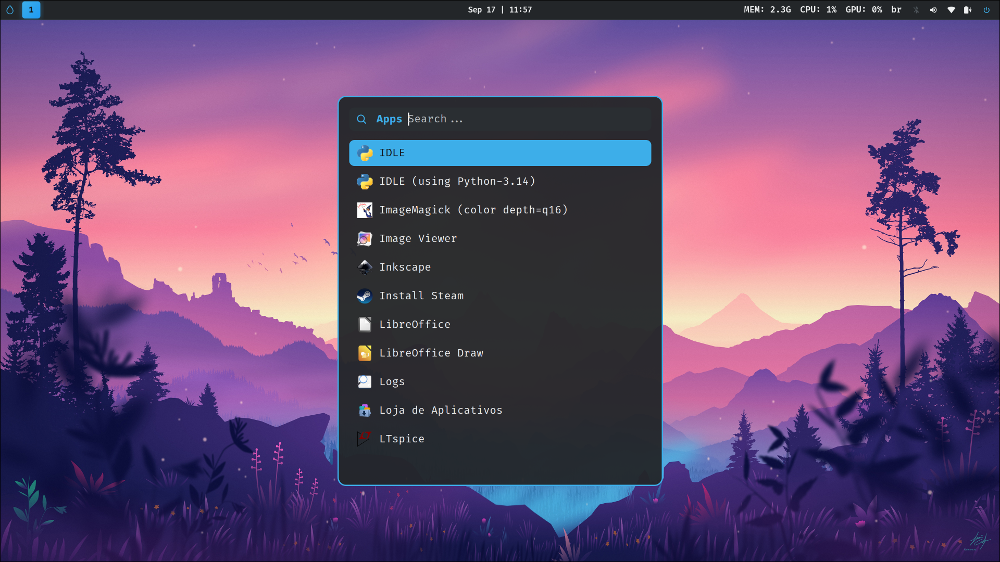
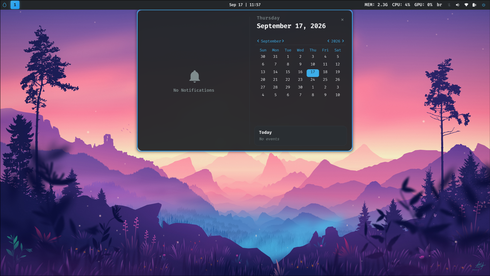
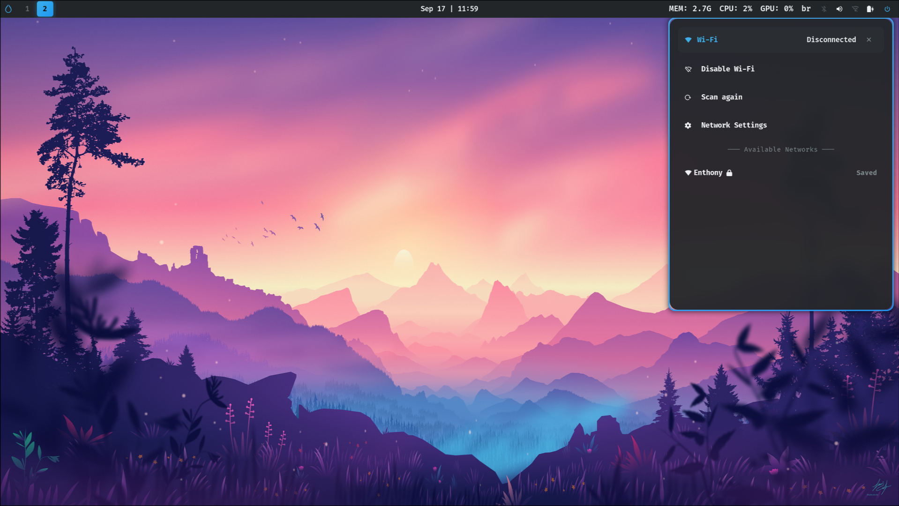
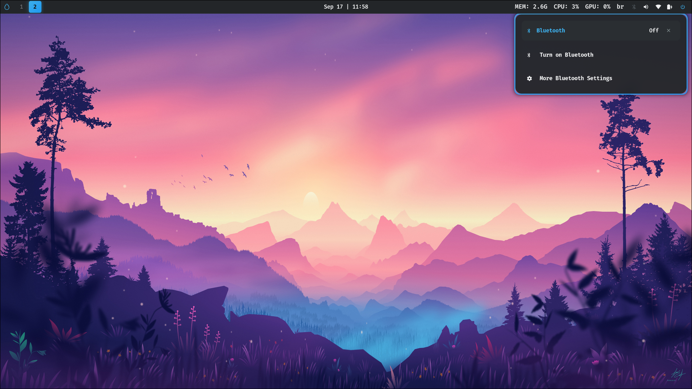
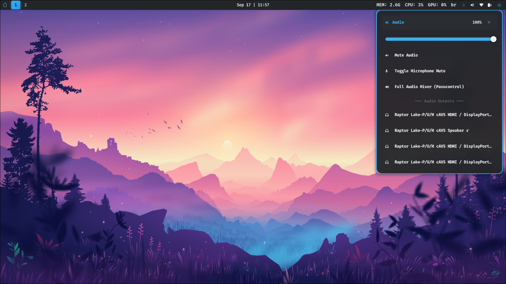
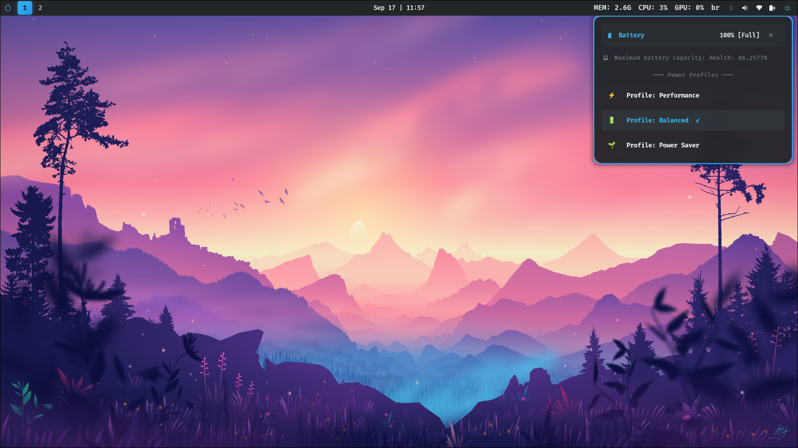

<h1 align="center">
  
  
  
  
</h1>

<h3 align="center">Hyprland Dotfiles</h3>

<p align="center">
  A clean and minimal Hyprland desktop environment on Ubuntu with custom Waybar, Rofi menus, GTK applets, and a unified dark/light theme switcher.
</p>

---

## 🖥️ Desktop



## Previews

| | |
|:---:|:---:|
|  |  |
| **Rofi Launcher** | **Calendar & Notifications** |
|  |  |
| **Wi-Fi Applet** | **Bluetooth Applet** |
|  |  |
| **Volume Control** | **Battery & Power** |

---

## Components

| Component | Tool |
|---|---|
| Window Manager | [Hyprland](https://hyprland.org) |
| Status Bar | [Waybar](https://github.com/Alexays/Waybar) |
| App Launcher | [Rofi](https://github.com/davatorium/rofi) |
| Terminal | [Kitty](https://sw.koez.com/kitty/) |
| Wallpaper | [Hyprpaper](https://github.com/hyprwm/hyprpaper) |
| Lock Screen | [Hyprlock](https://github.com/hyprwm/hyprlock) |
| Idle Daemon | [Hypridle](https://github.com/hyprwm/hypridle) |
| Notifications | [Dunst](https://dunst-project.org) |
| File Manager | [Nautilus](https://apps.gnome.org/Nautilus/) |
| Icons | [Kora](https://github.com/bikass/kora) |

## Tools

- [Obsidian](https://obsidian.md) — Notes & second brain
- [Neovim](https://neovim.io) — Editor
- [LaTeX & TeXstudio](https://www.texstudio.org) — Academic writing
- [Xournal++](https://xournalpp.github.io) — Handwriting & PDF annotation

## Features

- **Unified Theme Switcher** — Toggle between dark and light themes across the entire system (Waybar, Rofi, Kitty, Dunst, GTK, Hyprland borders, Btop)
- **Wallpaper Picker** — GTK3 applet with 16:9 thumbnails for quick wallpaper switching
- **Custom GTK Applets** — Wi-Fi, Bluetooth, Battery, Volume, Calendar — all built with Python + GTK3
- **Rofi Menus** — Power menu, app launcher, and theme/wallpaper settings

---

## Installation

For ArchLinux

```bash
git clone https://github.com/enthonyaraujo/hyprdots.git ~/hyprdots
cd ~/hyprdots
./scripts/hypr-install.sh
```

---

<p align="center">
  <sub>Made with by <a href="https://github.com/enthonyaraujo">enthonyaraujo</a></sub>
</p>
